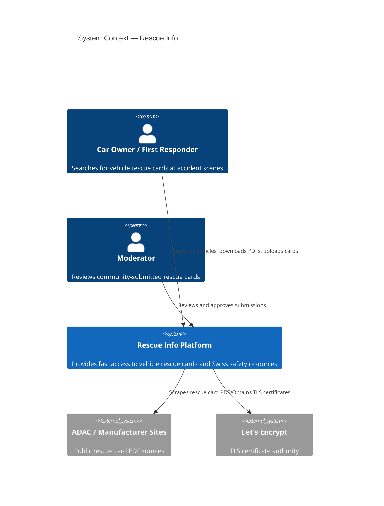
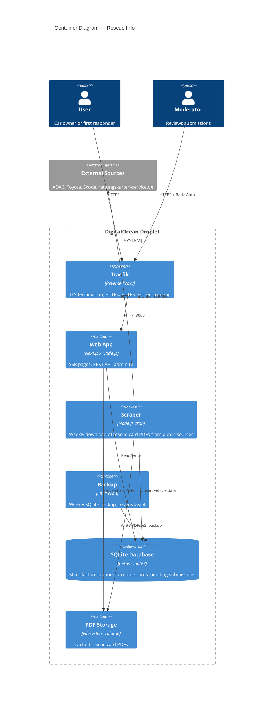

# Rescue Info

Fast access to vehicle rescue cards (Rettungskarten) and curated Swiss safety resources. Built for car owners and first responders at accident scenes.

## Features

- **Vehicle rescue card search** — find and download rescue cards by manufacturer, model, and year
- **Multilingual** — DE (default), FR, IT, EN
- **Community uploads** — anyone can submit missing rescue cards for moderator review
- **Automated scraper** — pulls rescue cards from ADAC, Toyota, Skoda, and other public sources
- **Mobile-first** — designed for use on phones at accident scenes
- **Source attribution** — every rescue card links back to its original source

## Tech Stack

- [Next.js](https://nextjs.org/) (App Router, SSR) + TypeScript
- [Tailwind CSS](https://tailwindcss.com/) v4
- [SQLite](https://www.sqlite.org/) via better-sqlite3
- [next-intl](https://next-intl.dev/) for i18n
- Docker + Traefik reverse proxy

## Architecture

### C4 Context



### C4 Container



## Getting Started

### Prerequisites

- Node.js 22+
- npm

### Install & Run

```bash
npm install
npm run db:init      # Create SQLite database schema
npm run db:seed      # Seed sample data (BMW, VW, Toyota)
npm run dev          # Start dev server at http://localhost:3000
```

### Available Scripts

| Command | Description |
|---------|-------------|
| `npm run dev` | Start development server |
| `npm run build` | Production build (standalone output) |
| `npm run lint` | Run ESLint |
| `npm run db:init` | Initialize SQLite database schema |
| `npm run db:seed` | Seed sample vehicle data |
| `npm run scrape` | Run all scraper adapters |

## Project Structure

```
src/
  app/
    [locale]/        # Locale-routed pages (de/fr/it/en)
    api/             # REST API (vehicles, PDFs, submissions, admin)
    admin/           # Admin moderation page (Basic Auth)
  components/        # Shared components (Header, Footer, VehicleSearch, Combobox)
  lib/               # Database singleton + query functions
  i18n/              # Routing, request config, navigation helpers
  messages/          # Translation files (en/de/fr/it.json)
scripts/
  scraper/           # Plugin-based scraper framework with source adapters
  traefik/           # Shared Traefik reverse proxy config
  init-db.ts         # Database schema initialization
  seed-sample-data.ts
  backup-db.sh       # SQLite backup script
  server-setup.sh    # Fresh server provisioning
data/                # SQLite DB + cached PDFs (gitignored)
```

## Deployment

Designed for Docker on a Linux VPS with Traefik as a shared reverse proxy.

### Services

The `docker-compose.yml` runs three containers:

- **web** — Next.js app on port 3000 (behind Traefik)
- **scraper** — Weekly cron that downloads rescue card PDFs and updates the database
- **backup** — Weekly SQLite backup (keeps last 4)

### Environment Variables

| Variable | Description | Default |
|----------|-------------|---------|
| `DOMAIN` | Public domain for Traefik routing | `localhost` |
| `ACME_EMAIL` | Email for Let's Encrypt certificates | — |
| `ADMIN_PASSWORD` | Password for admin moderation page | `changeme` |
| `DATABASE_PATH` | Path to SQLite database file | `/app/data/rescue-info.db` |

### DigitalOcean Setup (Step by Step)

#### Step 1 — Create Droplet

1. Log in to [DigitalOcean](https://cloud.digitalocean.com/)
2. **Create Droplet**:
   - Image: **Ubuntu 24.04 LTS**
   - Plan: **Basic — $6/mo** (1 vCPU, 1 GB RAM, 25 GB SSD) is sufficient
   - Region: **Frankfurt** (closest to Swiss users)
   - Authentication: **SSH Key** (add your public key)
3. Note the droplet's **IP address** once created

#### Step 2 — Point DNS

In your domain registrar (e.g. Infomaniak, Cloudflare):

1. Add an **A record**: `rescue-info.ch` → `<DROPLET_IP>`
2. Optionally add a **CNAME**: `www.rescue-info.ch` → `rescue-info.ch`
3. Wait for propagation (usually a few minutes, can take up to 24h)

Verify with: `dig rescue-info.ch +short`

#### Step 3 — Provision the Server

```bash
# SSH into the droplet as root
ssh root@<DROPLET_IP>

# Download and run the setup script
curl -fsSL https://raw.githubusercontent.com/sandrobuetler/rescue-info-platform/main/scripts/server-setup.sh | bash
```

This installs Docker, creates a `deploy` user, configures the firewall (ports 22/80/443), and creates the directory structure.

#### Step 4 — Set Up Traefik (Reverse Proxy)

```bash
# Still as root on the server
cd /opt/traefik

# Configure the ACME email for Let's Encrypt
cat > .env << 'EOF'
ACME_EMAIL=your-email@example.com
EOF

# Copy the Traefik compose file (or fetch from repo)
curl -fsSL https://raw.githubusercontent.com/sandrobuetler/rescue-info-platform/main/scripts/traefik/docker-compose.yml -o docker-compose.yml

# Start Traefik
docker compose up -d
```

Traefik now listens on ports 80/443, auto-redirects HTTP to HTTPS, and obtains Let's Encrypt certificates automatically.

#### Step 5 — Deploy the App

```bash
# Clone the repo
cd /opt/rescue-info
git clone https://github.com/sandrobuetler/rescue-info-platform.git .

# Create the environment file
cat > .env << 'EOF'
DOMAIN=rescue-info.ch
ACME_EMAIL=your-email@example.com
ADMIN_PASSWORD=<choose-a-strong-password>
DATABASE_PATH=/app/data/rescue-info.db
EOF

# Build and start all containers
docker compose up -d --build
```

#### Step 6 — Initialize the Database

```bash
# Create the schema
docker compose exec web npx tsx scripts/init-db.ts

# Run the scraper to populate data
docker compose exec web npx tsx scripts/scraper/index.ts
```

#### Step 7 — Set Up GitHub Actions (CI/CD)

Generate a deploy key on the server:

```bash
# As the deploy user
su - deploy
ssh-keygen -t ed25519 -f ~/.ssh/deploy_key -N ""
cat ~/.ssh/deploy_key.pub >> ~/.ssh/authorized_keys
cat ~/.ssh/deploy_key  # Copy this private key
```

In the GitHub repo, go to **Settings > Secrets and variables > Actions** and add:

| Secret | Value |
|--------|-------|
| `DEPLOY_HOST` | Your droplet IP address |
| `DEPLOY_USER` | `deploy` |
| `DEPLOY_KEY` | The private key from above |

Now every push to `main` triggers automatic deployment.

#### Step 8 — Verify

- Visit `https://rescue-info.ch` — should show the homepage with vehicle search
- Visit `https://rescue-info.ch/admin/review` — should prompt for Basic Auth (user: any, password: your `ADMIN_PASSWORD`)
- Check container health: `docker compose ps`
- Check logs: `docker compose logs -f web`

## Contributing

Contributions are welcome! You can help by:

- Submitting rescue cards via the [contribute page](/contribute)
- Writing new scraper adapters in `scripts/scraper/sources/`
- Improving translations in `src/messages/`
- Reporting bugs or suggesting features via [GitHub Issues](https://github.com/sandrobuetler/rescue-info-platform/issues)

## License

[GPL-3.0](LICENSE)
